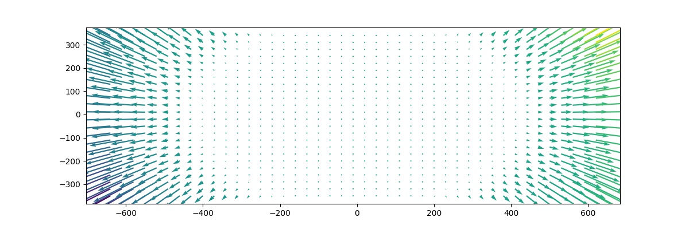

# Airphen Camera Spectral Band Alignment

Allignement is refined at different stage

## Phase 0 (Callibration):
+ detecte chessboard at different height of acquisition (0.8 to 5.0 meter with 20cm steep)
+ order detected points by x/y (detection can be fliped depending of the moon position)
+ each detected point is saved on data/

## Phase 1 (Affine Correction):
+ selecte the detected points of the nearest height (know by the user or using sensor)
+ compute the centroid grid (each point mean)
+ compute affine transfrom from each spectral band to this centroid grid
+ crop each spectral bands to the minimal bbox

## Phase 2 (Perspective Correction):
+ detect keypoints on all spectral bands using SURF (for time performance)
+ extract descriptor using ORB (for matche performance)
+ match keypoint of each spectral band to a reference (570:green seem the most valuable -> number of matches)
+ filter matches (distance, position, angle) to remove false positive one (pre-affine transform give epipolar line properties)
+ findHomography and perspective correction between each matches (current to reference)
+ estimate reprojection error (rmse+std near to 1 pixel)
+ crop each spectral bands to the minimal bbox

## Phase 3 (Radial/Tangential Correction):
+ TODO (potentiel refinement idea)
+ using the estimated reprojection error of each matches to estimate a displacement grid (spline)
+ estimate radial/tangential correction for each band to the reference
+ estimate reprojection error (rmse+std)
+ crop each spectral bands to the minimal bbox

# Potential related article:
+ https://www.tandfonline.com/doi/abs/10.1080/2150704X.2018.1446564
+ https://citius.usc.es/sites/default/files/publicacions_publicaciones/Alignment%20of%20Hyperspectral%20Images%20Using%20KAZE_Features_v2.pdf
+ https://pdfs.semanticscholar.org/25b6/4d89abdd36e0800da4679813935f055846dd.pdf