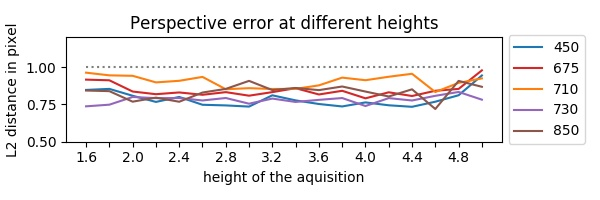

# Airphen Camera Spectral Band Alignment

## Material

AIRPHEN is a scientific multispectral camera developed by agronomists for agricultural applications.
It can be embedded in different types of platforms such as UAV, phenotyping robots, etc.
AIRPHEN is highly configurable (bands, fields of view), lightweight and compact.
It can be operated wireless and combined with complementary thermal infrared channel and high resolution RGB cameras.
The camera was configured using 450/570/675/710/730/850 nm with FWHM of 10nm. The focal lens is 8mm.
It's raw resolution for each spectral band is 1280x960 px with 12 bit of precision.
Finaly the camera also provide an internal GPS antenna.

## Data

Two dataset was taken at different height  (1.6 to 5.0 meter with 20cm steep).
+ One for the calibration a chessboard is taken at different height, the corresponding data can by found in data/steep-chess/.
+ One for the alignment verification one shot of a grassland is taken at different height, the corresponding data can by found in data/steep/

# Method

Allignement is refined at different stage (calibration, affine, prespective)
Each steep is explained here with corresponding figures and metrics.

## Phase 0 (Callibration):

+ detecte chessboard at different height of acquisition
+ order detected points by x/y (detection can be fliped depending of the moon position)
+ each detected point is saved on data/*.npy

## Phase 1 (Affine Correction):

+ selecte the detected points of the nearest height (know by the user or using the internal GPS sensor)
+ compute the centroid grid (each point mean)
+ compute affine transfrom from each spectral band to this centroid grid
+ crop each spectral bands to the minimal bbox

## Phase 2 (Perspective Correction):

Each spectral band have different properties and value by nature,
but we can extract corresponding similarity by transforming each spectral band to it's derivative
to find similarity in gradient break of those ones. The Sharr filter are used in this steep for is precision.

+ compute gradient using Sharr in each spectral band and normalize it
+ detect keypoints on all spectral bands gradient using FAST (for time performance)
+ extract descriptor using ORB (for matche performance)
+ match keypoint of each spectral band to a reference (570 or 710 seem the most valuable -> number of matches)
+ filter matches (distance, position, angle) to remove false positive one (pre-affine transform give epipolar line properties)

Different type of keypoint extractor has been tested {ORB, AKAZE, BRISK, SURF, FAST} all results can be found in figures/
Two algorithms show great numbers of keypoint after filtering and homography association such as FAST and BRISK.

Unless BRISK show good number of matched keypoints there computation time is too huge (~79 sec) comparing to FAST (~8 sec) without notable benefits.
SURF is can also be suitable for small gain of performances, the number of detected feature can be enought to fit the perspective correction,
but they reduce the residual precision to 1.1~1.2 px how is acceptable.

The following figure show the Minimum of number of matches between the reference spectra to all others using FAST algorithm.

+ findHomography between detected keypoints
+ perspective correction between each matches (current to reference)
+ estimate reprojection error (rmse+std near to 1 pixel)
+ crop each spectral bands to the minimal bbox

The following figure show the difference between detected point for two bands (red-green)
before (left) and after (right) the perspective correction.

You can notive in the above figure that the spatial distribution of the residual angle is equaly distributed.
Our hypothesis is that the nature of the base information (spectral band + different lens) make little difference on the gradient break,
who is detected by the features detector and propagated to the final correction (observed residual).
This is interesting stuff because this equaly distributed residual by angle in the space tend to minimize the resulted correction to his center (gradient).

# Conclusion

In this work was explored the application of different technicues for the registration of multispectral images.
We have tested different methodes of keypoint extraction at different height and the number of control point obtained.
As seen on the method, the best suitable methods is FAST with sinificant number of matches with "resonable" computation time.
Futhermore the best spectral reference was defined for each method, such as 710 for FAST.
According to the last figure "Allignment error at different height" we observe a residual error less than 1 px,
supposedly caused by the difference of the input (spectral range, lens).

Future work on spectral correction :
+ reducing as much as possible the impact of the weather
+ radial gradient
+ row reflectance

# Potential related article:

+ https://www.tandfonline.com/doi/abs/10.1080/2150704X.2018.1446564
+ https://citius.usc.es/sites/default/files/publicacions_publicaciones/Alignment%20of%20Hyperspectral%20Images%20Using%20KAZE_Features_v2.pdf
+ https://pdfs.semanticscholar.org/25b6/4d89abdd36e0800da4679813935f055846dd.pdf
+ https://www.insticc.org/Primoris/Resources/PaperPdf.ashx?idPaper=75802
+ https://arxiv.org/pdf/1606.03798.pdf